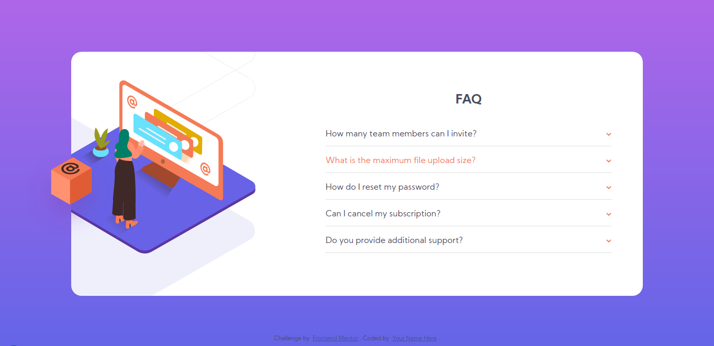

# Frontend Mentor - FAQ accordion card solution

This is a solution to the [FAQ accordion card challenge on Frontend Mentor](https://www.frontendmentor.io/challenges/faq-accordion-card-XlyjD0Oam). Frontend Mentor challenges help you improve your coding skills by building realistic projects.

## Table of contents

- [Overview](#overview)
  - [The challenge](#the-challenge)
  - [Screenshot](#screenshot)
  - [Links](#links)
- [My process](#my-process)
  - [Built with](#built-with)
  - [What I learned](#what-i-learned)
  - [Continued development](#continued-development)
- [Author](#author)

## Overview

### The challenge

Users should be able to:

- View the optimal layout for the component depending on their device's screen size
- See hover states for all interactive elements on the page
- Hide/Show the answer to a question when the question is clicked

### Screenshot

### Links

- Solution URL: [Add solution URL here](https://your-solution-url.com)
- Live Site URL: [Live site URL](https://moranguy.github.io/faq-accordion-card-main/)

## My process

### Built with

- Semantic HTML5 markup
- Flexbox
- Mobile-first workflow

### What I learned

I focused a lot on responsibility in this project, and I'm pretty happy with the overall result. This is the first time I've been using media queries, and while I feel I have much more to learn yet, I think I've made progress.

### Continued development

In my future projects I plan on focus more on responsibility in general and continue to use a mobile-first approach, as I've found it really helpful.

## Author

- Website - [MoranGuy GitHub](https://github.com/MoranGuy)
- Frontend Mentor - [@MoranGuy](https://www.frontendmentor.io/profile/MoranGuy)
- Twitter - [@Haritelz](https://www.twitter.com/Haritelz)
